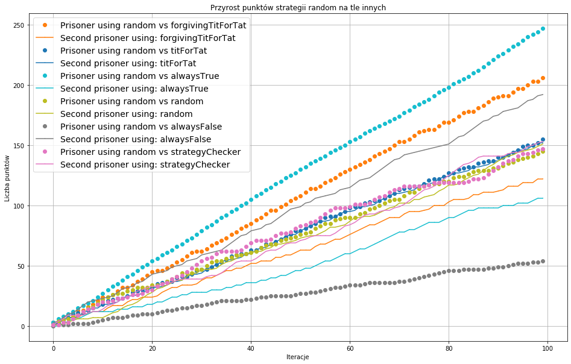
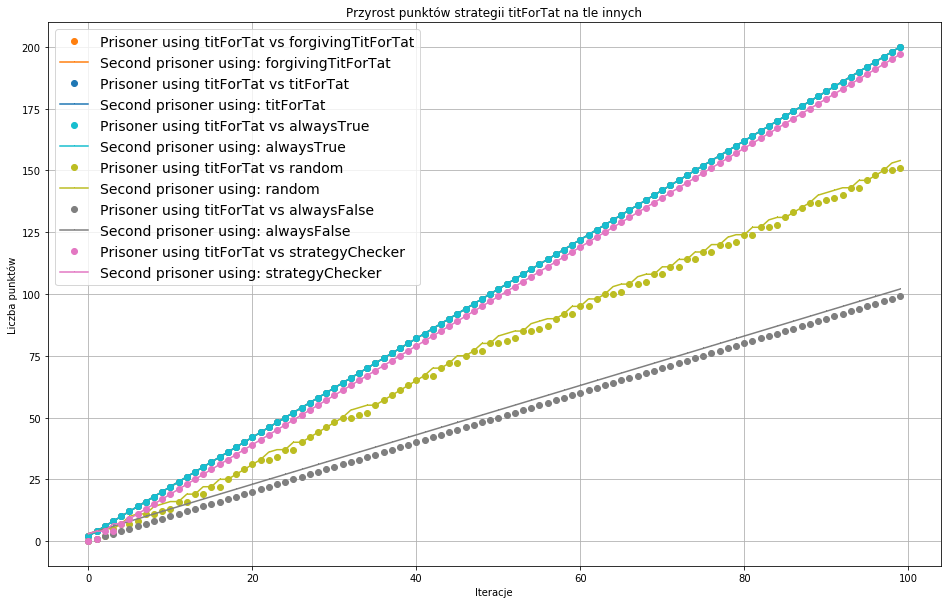
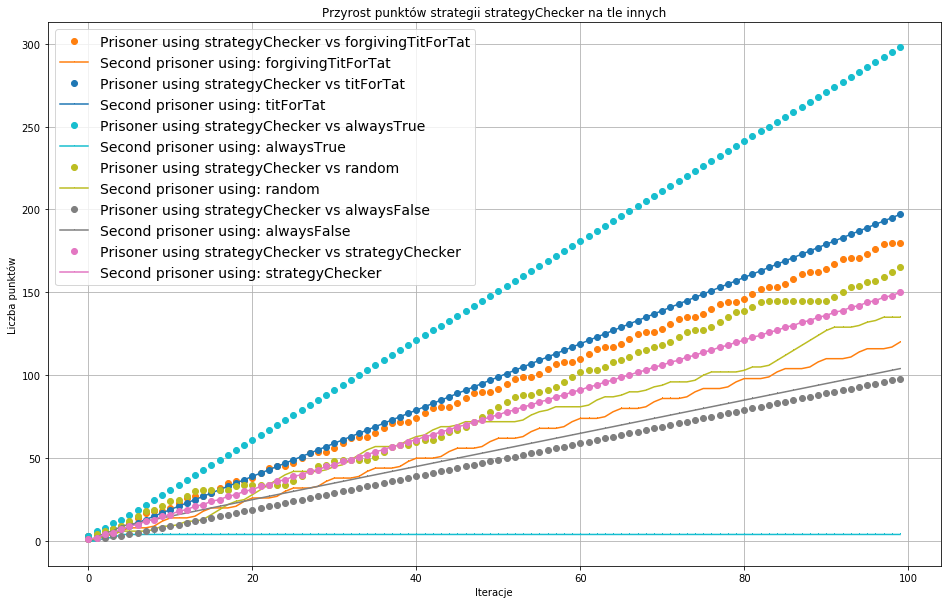

# Dylemat więźnia 
### Agentowe systemy społeczne i usytuowane
Mateusz Plinta, Radosław Kazior

Przeprowadzono analizę sześciu strategii podejmowania decyzji w popularnej grze - dylemat więźnia.
Symulację oraz strategie zaimplementowano w języku _Go_.
Wśród analizowanych strategii można wyróżnić:
* [random](#random) - losowanie decyzji więźnia
* [alwaysTrue](#alwaysTrue) - więzień zawsze idzie na współpracę
* alwaysFalse - więźień zawsze zdradza
* titForTat - rozpocznij od współpracy, następnie kopiuj ostatni ruch drugiego więźnia
* forgivingTitForTat - rozpocznij od współpracy; zdradź jedynie jeśli drugi więzień zdradzi dwa razy pod rząd
* strategyChecker - bardziej rozbudowana strategia; rozpoczyna od sekwencji: zdradź, zdradź, współpracuj, zdradź, współpracuj. Następnie, na podstawie decyzji drugiego więźnia, podejmuje odpowiednie decyzje. Cechy strategii: 
    * Próbuje nie współpracować jeśli natrafi na wsięźnia który nie współpracuje
    * Współpracuje gdy trafi na więźnia który chce współpracować
    * Raz współpracować i raz zdradzać gdy natrafi na więxnia który "wybacza"
    * Nie współpracować gdy trafi na więźnia który zawsze współpracuje

## random

## alwaysTrue

## alwaysFalse

## titForTat

## forgivingTitForTat

## strategyChecker

