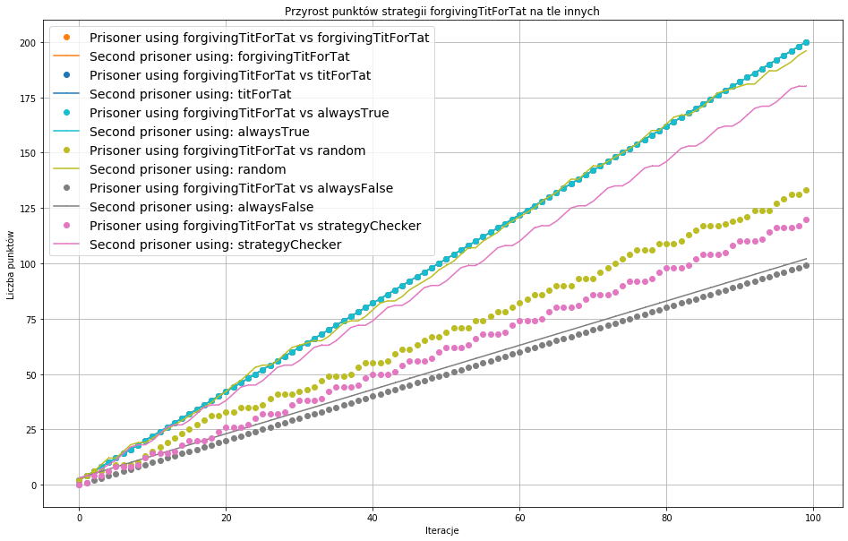

# Dylemat więźnia
### Agentowe systemy społeczne i usytuowane
Mateusz Plinta, Radosław Kazior

Przeprowadzono analizę sześciu strategii podejmowania decyzji w popularnej grze - dylemat więźnia.
Symulację oraz strategie zaimplementowano w języku _Go_.
Wśród analizowanych strategii można wyróżnić:
* [random](#random) - losowanie decyzji więźnia
* [alwaysTrue](#alwaysTrue) - więzień zawsze idzie na współpracę
* [alwaysFalse](#alwaysFalse) - więźień zawsze zdradza
* [titForTat](#titForTat) - rozpocznij od współpracy, następnie kopiuj ostatni ruch drugiego więźnia
* [forgivingTitForTat](#forgivingTitForTat) - rozpocznij od współpracy; zdradź jedynie jeśli drugi więzień zdradzi dwa razy pod rząd
* [strategyChecker](#forgivingTitForTat) - bardziej rozbudowana strategia; rozpoczyna od sekwencji: zdradź, zdradź, współpracuj, zdradź, współpracuj. Następnie, na podstawie decyzji drugiego więźnia, podejmuje odpowiednie decyzje. Cechy strategii:
    * Próbuje nie współpracować jeśli natrafi na wsięźnia który nie współpracuje
    * Współpracuje gdy trafi na więźnia który chce współpracować
    * Raz współpracować i raz zdradzać gdy natrafi na więźnia który "wybacza"
    * Nie współpracować gdy trafi na więźnia który zawsze współpracuje

Czas trwania symulacji wynosił 100 iteracji. Warto zauważyć, iż więźniowie nie znają długości trwania symulacji, aby nie mogli wykorzystać tej informacji do zdobycia większej ilości punktów, np. podczas ostatniej iteracji zdradzając.

Symulację przeprowadzono 10 razy, poniżej przedstawiono 6 wykresów porównujących daną strategię ze wszystkimi innymi, na przykładzie konkretnej symulacji.

## random

Dla porównania strategii **random** widzimy największe fluktuacje w przyroście punktów dla każdego algorytmu przeciwnika, co wynika z wbudowanej losowości tego algorytmu.

Najważniejsze wnioski z wykresu:
* używając strategii _random_ największą liczbę punktów zdobędziemy grając z więźniem wykorzysującym strategię _alwaysTrue_, trochę mniej punktów zdobędziemy grając z więźniem stosującym taktykę _forgivingTitForTat_
* strategia _random_ przegrywa znacząco ze _alwaysFalse_
* pozostałe wariancje strategii _random_ vs pozostałe mieszczą się w przedziale 100 - 150 pkt. dla końcowej iteracji

## alwaysTrue

Strategia _alwaysTrue_:
* przegrywa praktycznie do zera z _alwaysFalse_ oraz _strategyChecker_ - przeciwnicy uzyskują nawet do 300 punktów
* _alwaysTrue_ i _titForTat_ zdobywają kolejno tyle samo punktów, ponieważ ciągle współpracują

## alwaysFalse

Strategia _alwaysFalse_:
* wygrywa do zera z _alwaysTrue_
* osiąga trochę gorszy wynik, ale wciąż wygrywa, ze strategią _random_
* idzie ex aequo w starciu z pozostałymi strategiami, osiągając końcowy wynik ok. 100 pkt.

## titForTat

Strategia _titForTat_:
* ex aequo w starciu z _titForTat_ oraz _forgivingTitForTat_,
* vs _alwaysFalse_ osiągają prawie tą samą ilość punktów, najmniejszą w porównaniu ze wszystkimi innymi strategiami, w wysokości 100 pkt. po ostatniej iteracji

## forgivingTitForTat

Strategia _forgivingTitForTat_:
* jak opisano powyżej, najwyższe wyniki uzyskuje w starciu z _titForTat_
* przegrywa tę samą ilością punktów z _random_ co uzyskuje w starciu z _titForTat_, oraz trochę mniejszą ilością punktów ze _strategyChecker_

## strategyChecker

Strategia _strategyChecker_:
* najlepiej wypada w starciu ze _alwaysTrue_, zmiatając przeciwnika 300 pkt. do 0
* najmniej opłacalna przy walce z _alwaysFalse_, obie strony osiągną prawie 100 pkt., z niewielką przewagą przeciwnika
* **strategia ta jest najlepsza do walki praktycznie ze wszystkimi innymi zakładanymi przez nas strategiami, poza _alwaysFalse_ z którym przegramy, oraz _titForTat_, z którym zostanie osiągnięty remis**

## Podsumowanie - słupki

Wykresy [podsumowanie 1](#summary) oraz [podsumowanie 2](#summary_stacked) przedstawiają średnie wartości wszystkich zdobytych punktów obu więźniów po wykonaniu się ostatniej iteracji, wraz z odchyleniem standardowym tych wartości. Należy zaznaczyć, iż nie wszystkie pary strategii posiadają odychylenie standardowe, ponieważ suma zdobotych punktów jest zawsze taka sama, co wynika z braku losowości w obu algorytmach.
## Podsumowanie - słupki na stosie

Wykresy różnią się jedynie położeniem słupków (w pods. 2 są na jednen nad drugim), aby zwiększyć czytelność wykresów.

**Wnioski:**
* najwyższe wyniki uzyskujemy wykorzystując strategię _strategyChecker_ lub _alwaysFalse_ w walce z _alwaysTrue_ (ponieważ w przypadku gdy przeciwnik korzysta z _alwaysTrue_, _strategyChecker_ właściwie staje się _alwaysFalse_)
* największe odchylenie standardowe obserwujemy w pojedynku między _strategyChecker_ i _random_ - obie partie osiągają porównywalne wyniki; w tym starciu nie możemy stwierdzić z jakąkolwiek pewnością o wygranej kogokolwiek, dopóki nie zakończymy symulacji
* kolejny najwyższy wynik można uzyskać stosując strategię _random_ przeciwo _alwaysTrue_
* średnio podobne wyniki uzyskamy stosując poniższe kombinacje:
  * _titForTat_ vs _titForTat_
  * _titForTat_ vs _alwaysTrue_
  * _titForTat_ vs _forgivingTitForTat_
  * _titForTat_ vs _strategyChecker_
  * _alwaysTrue_ vs _alwaysTrue_
  * _alwaysTrue_ vs _forgivingTitForTat_
  * _forgivingTitForTat_ vs _forgivingTitForTat_
